# Flour Mill Management System (Core PHP)

> *A complete flour mill business management system built from scratch using core PHP and MySQL.*

---

## About This Project

This project is a **Flour Mill Management System** designed to manage real-world mill operations like stock handling, sales, purchases, and financial tracking.

Instead of relying on manual records, this system provides a structured and efficient way to manage the entire workflow — from suppliers and customers to reports and ledgers.

The focus was on building a **practical, usable system** with clean structure and essential business features.

---

## Core Features

### Authentication

* Secure login/logout system
* Session-based access control

---

### Stock & Product Management

* Manage product inventory
* Track available stock
* Automatic stock updates based on sales & purchases

---

### Sales Management

* Create and manage sales
* View detailed sale records
* Export sales reports as PDF
* Filter sales by date

---

### Purchase Management

* Record purchases from suppliers
* Maintain incoming stock records
* Export purchase reports as PDF
* Date-wise filtering

---

### Customer Management

* Store and manage customer details
* Track customer-related transactions

---

### Supplier Management

* Manage supplier records
* Link suppliers with purchases

---

### Reports System

* Generate structured reports
* Filter reports by date
* Export reports to PDF

---

### Ledger System (Important Feature)

* **Customer Ledger**

  * Track customer balances and transactions

* **Supplier Ledger**

  * Track payments and purchase history

This makes the system closer to a real accounting workflow.

---

### Transactions

* Record financial activities
* Maintain clear transaction history

---

### PDF Generation

* Integrated PDF export using TCPDF
* Used in:

  * Sales reports
  * Purchase reports

---

### Backup System

* Backup database for data safety

---

## Tech Stack

* **Frontend:** HTML, CSS, Bootstrap
* **Backend:** Core PHP (MySQLi)
* **Database:** MySQL
* **PDF Library:** TCPDF
* **Server:** XAMPP

---

## Screenshots

### Dashboard
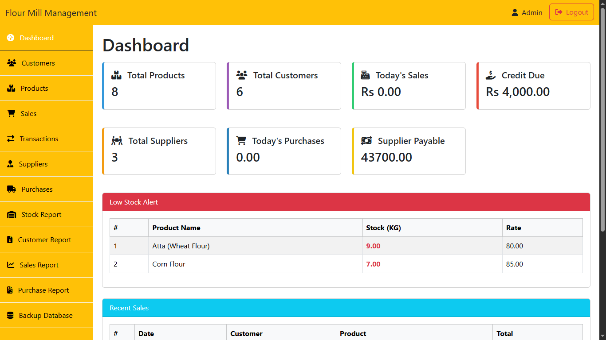

### Products Management
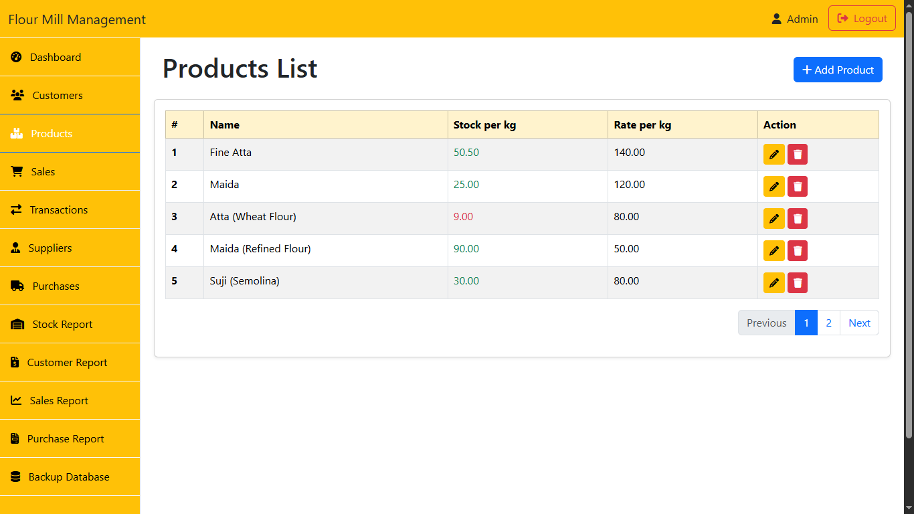

### Customers Management
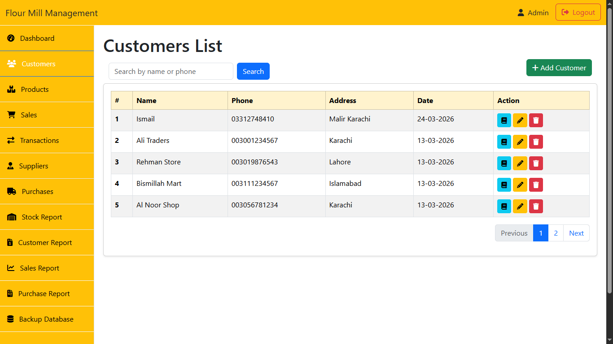

### Suppliers Management
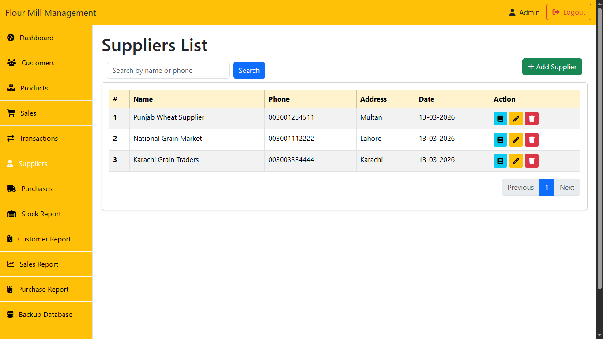

### Sales Management
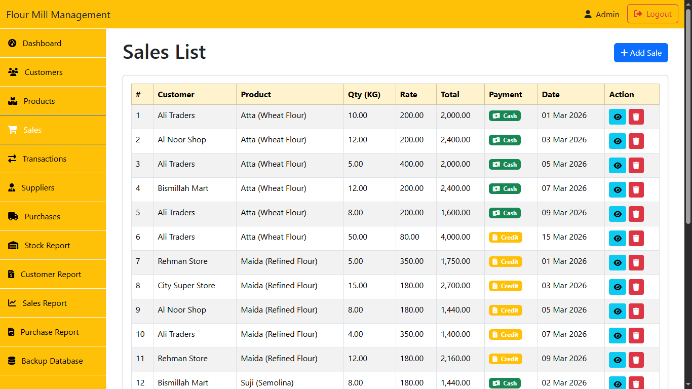

### Purchase Management
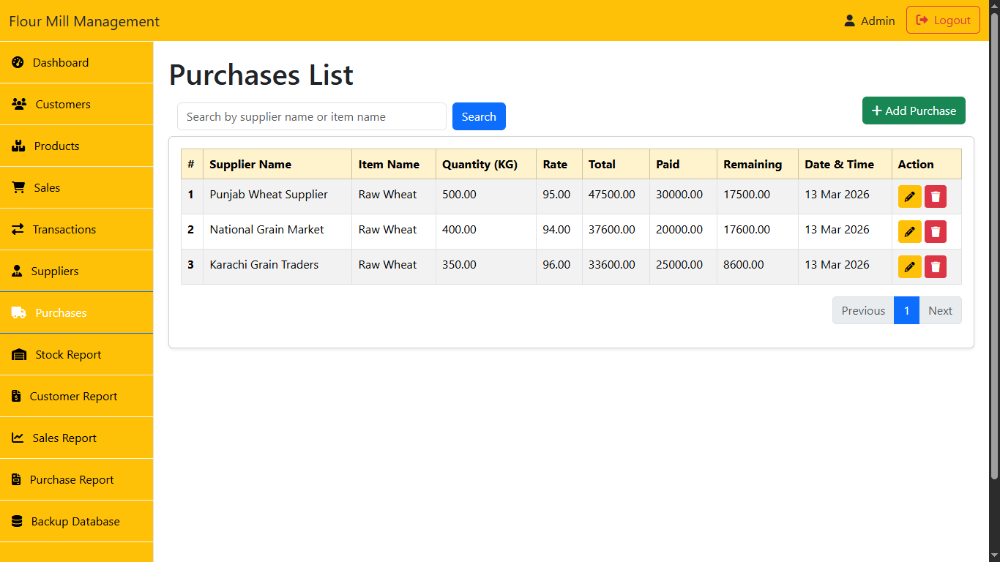

## Reports

### Sales Report (Date Filter + PDF Export)
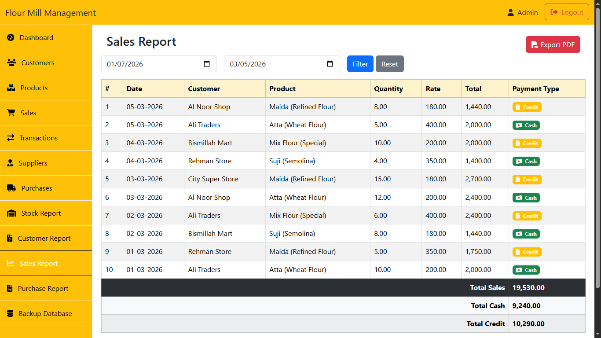
### Customers Report
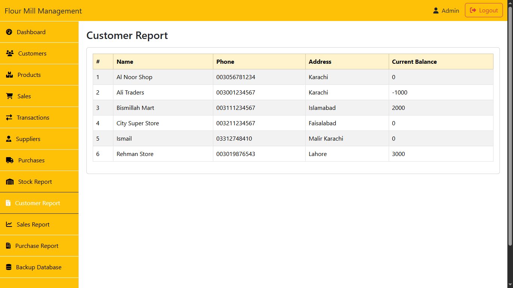
### Sales Report (Date Filter + PDF Export)
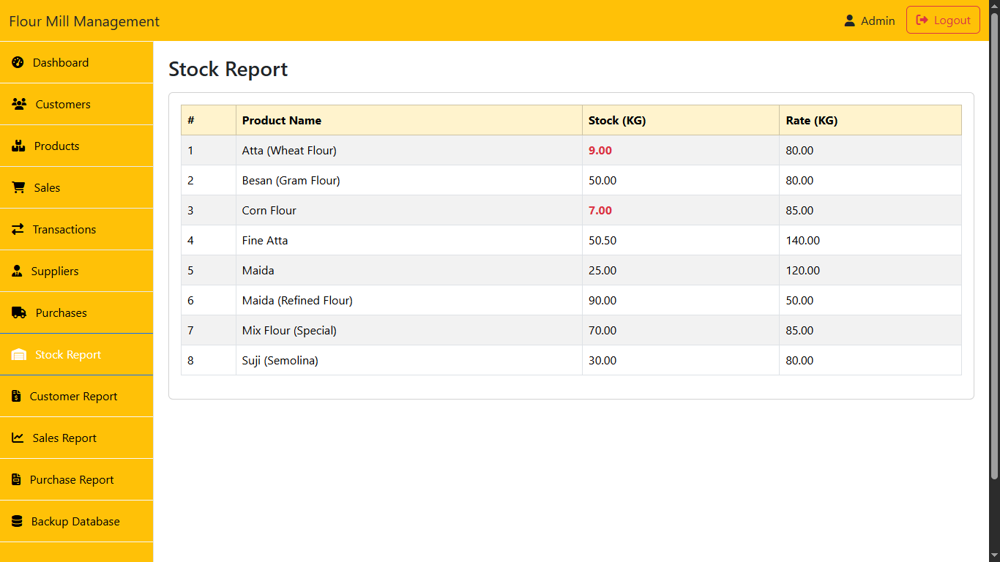
### Purchases Report
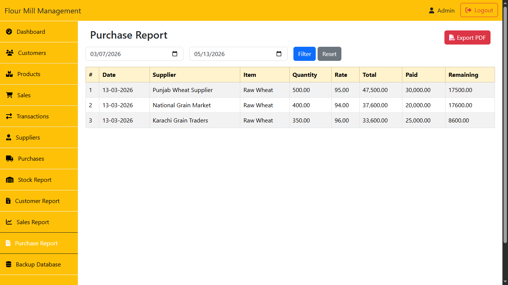


### Customer Ledger
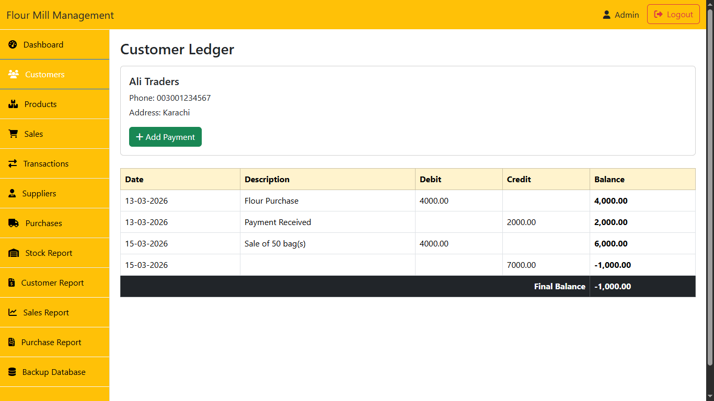

### Supplier Ledger
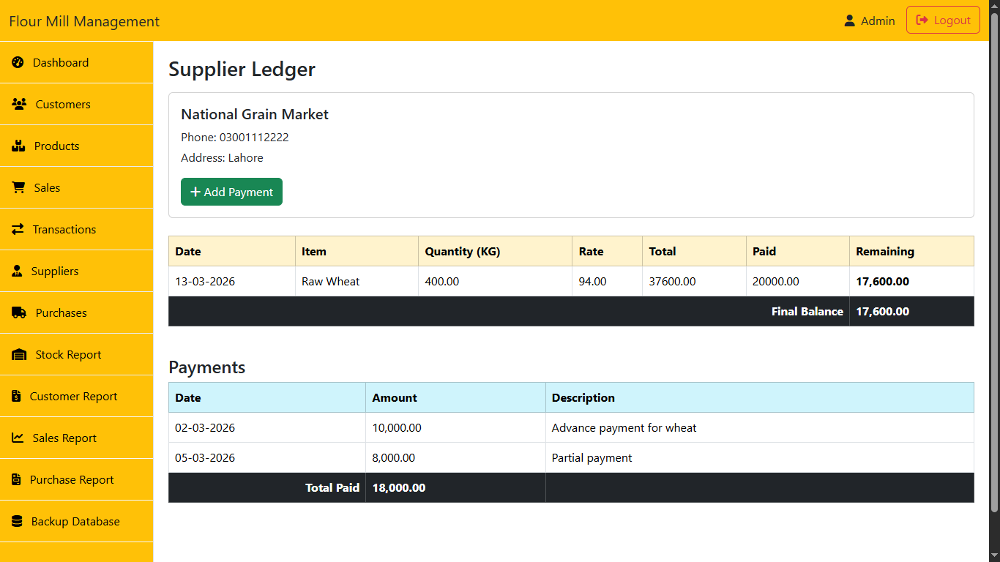

### PDF Report
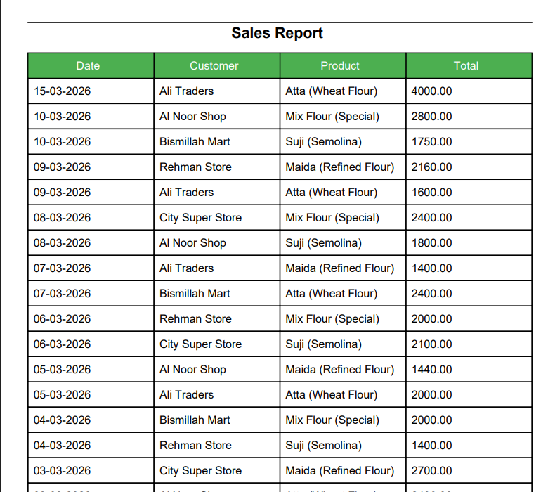

## Key Highlights

* Built completely using **core PHP (no framework)**
* Implemented **prepared statements** for security
* Applied **input validation & sanitization**
* Designed around **real business flow (sales ↔ purchases ↔ stock)**
* Includes **ledger system (rare in beginner projects)**

---

## Project Structure

```bash
Flour_mill_system/
│── assets/        
│── auth/          
│── backups/       
│── customers/     
│── includes/      
│── layout/        
│── products/      
│── purchases/     
│── reports/       
│── sales/         
│── suppliers/     
│── TCPDF/         
│── transactions/  
│── index.php      
```

---

## Setup Instructions

1. Clone the repository

   ```bash
   git clone https://github.com/Usaid136/flour-mill-system-php.git
   ```

2. Move project to:

   ```
   C:\xampp\htdocs\
   ```

3. Start Apache & MySQL

4. Create database:

   ```
   flour_mill
   ```

5. Import:

   ```
   database.sql
   ```

6. Configure DB:

   ```
   includes/db.php
   ```

7. Run:

   ```
   http://localhost/Flour_mill_system
   ```

---

## Future Improvements

* Role-based access (Admin / Staff)
* Advanced financial reports
* Charts & analytics dashboard
* Excel export
* MVC architecture refactor

---

## Final Thoughts

This project was built to simulate a **real business management system**, not just a basic CRUD application.

It helped me understand how different modules like **stock, sales, purchases, and ledgers** connect together in a complete workflow.

---

## Repository

👉 [https://github.com/Usaid136/flour-mill-system-php](https://github.com/Usaid136/flour-mill-system-php)

---


